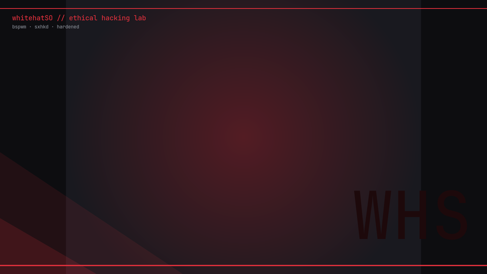

# whitehatSO

> **Ubuntu 25.10 convertido en un laboratorio de ethical hacking** — tiling con bspwm, kitty con estilo propio, polybar operativa, rendimiento afinado y cero telemetría.

<p align="center">
  
</p>

---

## ¿Qué es?

whitehatSO no es una distribución nueva: es un **conjunto de configuraciones, scripts y ajustes de sistema** que transforman un Ubuntu 25.10 recién instalado (o el tuyo de siempre) en un entorno de trabajo pensado para ciberseguridad ofensiva/defensiva, con estética terminal roja (#e0303c) y filosofía *minimal + rápido + todo bajo control*.

### Qué incluye

| Componente | Detalle |
|---|---|
| **Gestor de ventanas** | bspwm (tiling binario) + sxhkd (atajos) + picom (compositor afinado para VM) |
| **Terminal** | kitty con paleta roja/gris, transparencia 0.92, pestañas powerline y cierre con confirmación Si/No (Ctrl+W) |
| **Panel** | polybar con módulo **ATK** (IP de atacante con `settarget`), control bettercap/tor, menú de poder |
| **Prompt bash** | Logo Ubuntu + ruta absoluta + ✓/✗ del último comando + ☠ rojo y `#` en modo root |
| **Launcher** | rofi (drun) con reglas flotantes y el diálogo de cierre integrado |
| **Login** | lightdm + greeter GTK temático (Yaru-red-dark, fondo generativo rojo, JetBrains Mono) |
| **Rendimiento** | zram zstd (hasta 8 GB), swappiness 10, vfs_cache_pressure 50, journald 150 MB, earlyoom anti-freeze, I/O scheduler `none` en SSD/VM |
| **Debloat** | Telemetría fuera (whoopsie, apport, ubuntu-report/insights, unattended-upgrades), snapd fuera, servicios on-demand (bettercap, tor, cups, avahi, bluetooth, cloud-init desactivados/maskados) |
| **VMware** | Resolución dinámica real (modesetting + RandR), portapapeles bidireccional host↔VM, autofit en sesión |
| **Herramientas propias** | `whs-bettercap`, `whs-status`, `whs-help`, `settarget`, `whitehatso-close`, `whitehatso-lock` |

> ⚠️ **Seguridad ante todo**: el instalador incluye una **lista de paquetes protegidos** (`xorg`, `lightdm`, `bspwm`, `mesa`, …) que jamás se desinstalan durante el debloat, y realiza **copias de seguridad** de tus configs en `~/.config/backups/whitehatso-<fecha>/`.

---

## Instalación

### Requisitos

- Ubuntu **25.10** (otras versiones pueden funcionar pero no están probadas; el script te avisará)
- Usuario con permisos `sudo`
- Conexión a internet (paquetes apt + fuente JetBrainsMono Nerd Font)

### Opción A — instalador autocontenido (recomendada)

El script lleva **incrustados** todos los configs, scripts y wallpapers (no descarga nada del repo en tiempo de ejecución):

```bash
curl -fsSL https://raw.githubusercontent.com/D1se0/environment-ubuntu-installer/main/install-whitehatso.sh -o install-whitehatso.sh
chmod +x install-whitehatso.sh
sudo bash install-whitehatso.sh
```

Te irá preguntando qué quieres aplicar:

1. **Usuario** a configurar
2. **Paquetes base** (Xorg, lightdm, bspwm, kitty, polybar, rofi, fuentes…)
3. **Rendimiento** (zram, sysctl, debloat de telemetría/servicios, Firefox .deb nativo)
4. **Login temático** lightdm
5. **Fixes VMware** (resolución dinámica + portapapeles)
6. **Prompt con calavera** también para root

Al terminar: **cierra sesión** y elige la sesión **whitehatSO (bspwm)** en el menú del login.

### Opción B — modo desatendido

Ideal para scripting, chroots (Cubic) o replicar en varias máquinas:

```bash
WHS_ASSUME_YES=1 WHS_USER=tu_usuario sudo -E bash install-whitehatso.sh
```

### Opción C — clonar y construir

```bash
git clone https://github.com/D1se0/environment-ubuntu-installer.git
cd environment-ubuntu-installer
bash build-installer.sh        # regenera install-whitehatso.sh desde payload/
sudo bash install-whitehatso.sh
```

---

## Estructura del repositorio

```
environment-ubuntu-installer/
├── install-whitehatso.sh        # ← el instalador autocontenido (generado)
├── build-installer.sh           # regenera el instalador desde payload/ + template/
├── template/
│   └── installer-template.sh    # lógica del instalador (payload como placeholder)
├── payload/                     # fuente de verdad de TODOS los configs
│   ├── home/
│   │   ├── dot-bashrc           # .bashrc completo (prompt, aliases, binds Ctrl+W)
│   │   └── .config/
│   │       ├── bspwm/bspwmrc
│   │       ├── sxhkd/sxhkdrc
│   │       ├── kitty/kitty.conf
│   │       ├── picom/picom.conf
│   │       ├── polybar/ (config + scripts)
│   │       ├── rofi/config.rasi
│   │       ├── fastfetch/ (config + logo)
│   │       └── dunst/dunstrc
│   ├── system/
│   │   ├── usr-local-bin/       # whs-*, whitehatso-*, settarget, burpsuite…
│   │   └── etc/                 # sysctl, udev, zram, lightdm, xsessions, xorg.conf.d
│   └── prompt-block.sh          # el bloque del prompt (referencia)
├── assets/
│   ├── login-whitehatso.png     # fondo del login
│   └── wallpapers/wallpaper.png
├── website/                     # página (React + Vite + Tailwind) para GitHub Pages
└── .github/workflows/
    ├── pages.yml                # despliega la web en GitHub Pages
    └── release.yml              # build del instalador + adjunto en cada release
```

---

## Atajos de teclado

Todos viven en `~/.config/sxhkd/sxhkdrc`. *super* = tecla Windows.

| Atajo | Acción |
|---|---|
| `super + Return` | Abrir kitty |
| `super` / `ctrl + space` | Rofi (lanzador de apps) |
| `ctrl + w` | **Cerrar ventana con confirmación Si/No** |
| `super + shift + q` | Cerrar ventana sin confirmación |
| `super + {1…5}` | Ir al escritorio 1–5 |
| `super + shift + {1…5}` | Mandar ventana al escritorio 1–5 |
| `super + h/j/k/l` | Mover el foco (vim-style) |
| `super + shift + h/j/k/l` | Intercambiar ventanas |
| `super + ctrl + h/j/k/l` | Redimensionar ventanas |
| `super + f` | Pantalla completa (toggle) |
| `super + shift + space` | Flotante (toggle) |
| `super + shift + l` | Bloquear pantalla (i3lock rojo con captura borrosa) |
| `super + shift + r` | Recargar sxhkd |
| `print` | Flameshot (captura con edición) |
| `super + click izq/der` | Mover / redimensionar con ratón |

> En kitty, `ctrl+w` está **mapeado dentro de la terminal** además de en sxhkd, para que el protocolo de teclado de kitty no se coma la tecla (evita el famoso `9;9u`). Extra: bash también interpreta las secuencias `119;5u`/`9;9u` como cierre por si usas otra terminal con protocolo kitty (ptyxis, ghostty…).

---

## Comandos propios

| Comando | Qué hace |
|---|---|
| `whs-bettercap on\|off` | Arranca/para bettercap + tor bajo demanda |
| `whs-status` | RAM, disco, zram y estado de tor/bettercap/snapd |
| `whs-help` | Chuleta de comandos |
| `settarget 10.10.14.7` | Marca la IP objetivo → el módulo **ATK** de polybar la muestra en rojo (`settarget` sin argumento la borra) |
| `whitehatso-close` | Diálogo Si/No de cierre (lo que usa Ctrl+W) |
| `whitehatso-lock` | Bloqueo con fondo borroso y anillo rojo |

---

## El prompt

```
  │ ~/ruta/actual ✓ $
  │ /etc ❌ ✗ #      ← (en root: ☠ rojo y #)
```

- Logo de Ubuntu (glifo Nerd Font, naranja)
- ☠ aparece solo con `sudo -i` / `su -`
- ✓ verde si el comando anterior terminó bien, ✗ rojo si falló
- Ruta **absoluta** siempre

---

## Rendimiento: qué cambia

| Ajuste | Valor |
|---|---|
| zram | `min(ram, 8192)` MB, zstd, prioridad 100 |
| vm.swappiness | 10 |
| vm.vfs_cache_pressure | 50 |
| vm.page-cluster | 0 |
| kernel.nmi_watchdog | 0 |
| journald | 150 MB, comprimido |
| I/O scheduler | `none` (SSD/VM) vía udev |
| earlyoom | activo (evita congelamientos por RAM) |
| Telemetría | whoopsie, apport, ubuntu-report/insights, unattended-upgrades: **purgedos** |
| snapd | eliminado (Firefox nativo .deb de Mozilla si no existe) |

Estado de referencia (VM con 4 vCPU / 5,3 GB): **~850 MiB de RAM en reposo**, 0 unidades systemd fallidas.

---

## FAQ

**¿Puedo instalarlo sobre mi sistema ya configurado?**
Sí. El instalador respalda tus configs en `~/.config/backups/whitehatso-<fecha>/` y no toca tu usuario ni tus datos.

**¿Funciona en físico (no VM)?**
Sí. Los ajustes VMware son un módulo opcional; en físico simplemente no los apliques (o aplícalos, son inofensivos con hardware real).

**¿Y si algo sale mal?**
Tus configs anteriores están en el directorio de backups, y el debloat **nunca** toca los paquetes de la lista protegida. Para revertir el prompt: restaura el `.bashrc` del backup.

**¿Cómo añado un atajo?**
Edita `~/.config/sxhkd/sxhkdrc` y ejecuta `super + shift + r` (o `pkill -USR1 -x sxhkd`).

---

## Despliegue de la web (GitHub Pages)

La web vive en `website/` (React + Vite + Tailwind) y se publica automáticamente con **GitHub Actions** en cada push a `main` que toque `website/`. Configuración:

1. Repo → **Settings → Pages** → Source: **GitHub Actions**
2. La base de Vite se ajusta con la variable `BASE_PATH` (por defecto `/environment-ubuntu-installer/`)
3. Para desarrollo local: `cd website && npm install && npm run dev`

## Releases

El workflow `release.yml` construye `install-whitehatso.sh` y lo adjunta como artefacto descargable en cada release. Para publicar una nueva:

```bash
git tag v1.0.1 && git push origin v1.0.1
```

Y crea la release desde la web de GitHub (o con `gh release create v1.0.1 --generate-notes`).

---

## Licencia

MIT — úsalo, modifícalo y comparte. Las herramientas de pentesting referenciadas (bettercap, tor, wpscan, Burp) mantienen sus propias licencias y **debes usarlas solo en entornos donde tengas autorización explícita**.

<p align="center"><i>"Stay white hat." ☠</i></p>
